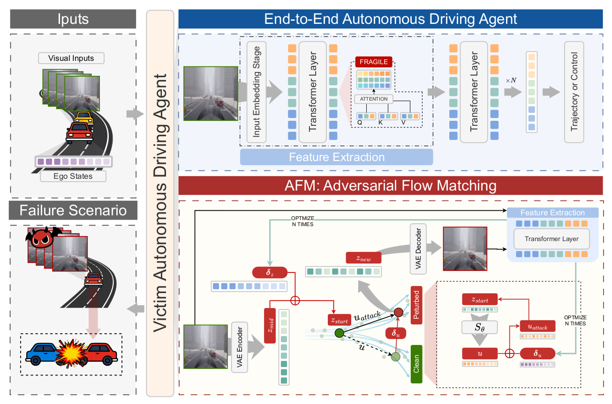

# AFM: Adversarial Flow Matching for Imperceptible Attacks on End-to-End Autonomous Driving

  
  
  

**AFM** is a novel **gray‑box adversarial attack** against end‑to‑end autonomous driving agents.  
It exploits the structural vulnerabilities of **Transformer backbones** (used by both monolithic VLA models and modular architectures) and generates **visually imperceptible** adversarial examples in **one step** (1‑NFE) via a neural average velocity field.

> 🔥 **Key highlights**  
>
> - First application of **Flow Matching** for adversarial attacks on autonomous driving.  
> - **Gray‑box** setting: only requires knowing that the victim uses a Transformer module (no full weights or gradients).  
> - **One‑step generation** – 40% faster than diffusion‑based attacks, with state‑of‑the‑art imperceptibility.  
> - Effective on **VLA** (SimLingo) and **modular** (TransFuser) agents in both open‑loop and closed‑loop (CARLA/Bench2Drive) evaluations.

---

## ✨ Attack Overview

The proposed **Adversarial Flow Matching (AFM)** framework:

- Inverts a clean image into the latent space via a frozen VAE encoder.
- Injects **dual perturbations**: $\delta_z$ (latent space) and $\delta_u$ (neural velocity field).
- Performs **single‑step ODE update** (1‑NFE) using a pre‑trained Flow Matching network.
- Optimizes an **attention‑guided loss** that focuses on road regions and high‑saliency tokens.

The resulting adversarial image remains virtually indistinguishable from the clean input but forces the target AD agent into hazardous maneuvers (e.g., off‑road, collisions).

 

  
   
  <em>Fig. 2 from the paper – Overview of the AFM framework</em>

---

## 📊 Experimental Results

### 🧪 Experimental Setup

#### 🤖 Representative Models

We evaluate AFM on two distinct end‑to‑end AD paradigms:

- **TransFuser** – a *specialized modular architecture* that fuses RGB and LiDAR BEV using Transformer modules at intermediate layers.  
- **SimLingo** – a *monolithic VLA model* built on InternVL2 + Qwen2 LLM, where we attack the Vision Transformer (ViT) component.

Both rely on Transformer backbones – the only prior knowledge required by our gray‑box attack.

#### 📁 Datasets & Scenarios

| Model      | Dataset                  | Frames     | Scenarios                                        |
| ---------- | ------------------------ | ---------- | ------------------------------------------------ |
| TransFuser | CARLA IL (Chitta et al.) | 228k @ 2Hz | Complex (dense intersections) / Common (highway) |
| SimLingo   | PDM‑lite (Renz et al.)   | 3.1M @ 4Hz | Daytime / Nighttime                              |

Closed‑loop evaluation uses **Bench2Drive** (10 routes, CARLA).

#### ⚙️ Implementation Details

- Perturbation bounds: `ε_z = 0.03`, `ε_u = 0.03`
- Loss weights: `λ_f = 3.0` (road‑focused), `λ_a = 4.5` (attention), `λ_c = 6.0` (latent constraint)
- Optimizer: Adam, 50 iterations, `η_z = η_u = 0.05`
- Hardware: RTX 4090 (open‑loop), A800 80G (closed‑loop)

---

### 📈 Open-loop Evaluation
<small>**Table I – PERFORMANCE COMPARISON OF ATTACK METHODS ON TRANSFUSER(modular paradigms) ACROSS COMPLEX(H) AND COMMON(E) SCENARIOS**</small>
<table>
  <thead>
    <tr>
      <th rowspan="2">Method</th>
      <th colspan="2">SHIFT (m) ↑</th>
      <th colspan="2">SR (%) ↑</th>
      <th colspan="2">LPIPS ↓</th>
      <th colspan="2">SSIM ↑</th>
      <th colspan="2">FID ↓</th>
      <th colspan="2">TIME (s) ↓</th>
    </tr>
    <tr>
      <th>H</th><th>E</th>
      <th>H</th><th>E</th>
      <th>H</th><th>E</th>
      <th>H</th><th>E</th>
      <th>H</th><th>E</th>
      <th>H</th><th>E</th>
    </tr>
  </thead>
  <tbody>
    <tr><td>FGSM</td><td>4.188</td><td>4.889</td><td>79.99</td><td>89.71</td><td>0.379</td><td>0.370</td><td>0.697</td><td>0.708</td><td>42.401</td><td>64.187</td><td>6.134</td><td><b>0.140</b></td></tr>
    <tr><td>PGD</td><td>5.792</td><td>5.997</td><td>84.98</td><td>92.03</td><td>0.372</td><td>0.359</td><td>0.722</td><td>0.732</td><td>42.271</td><td>58.425</td><td><b>1.208</b></td><td>1.230</td></tr>
    <tr><td>DiffAttack</td><td>1.515</td><td>2.465</td><td>60.91</td><td>60.12</td><td>0.170</td><td>0.165</td><td>0.865</td><td>0.871</td><td>20.794</td><td>36.565</td><td>10.616</td><td>10.606</td></tr>
    <tr><td>PerC-AL</td><td><b>6.741</b></td><td><b>6.809</b></td><td><b>99.28</b></td><td><b>97.06</b></td><td>0.685</td><td>0.694</td><td>0.202</td><td>0.196</td><td>190.116</td><td>223.980</td><td>10.979</td><td>11.153</td></tr>
    <tr><td>NCF</td><td>0.261</td><td>0.517</td><td>7.32</td><td>15.34</td><td>0.262</td><td>0.256</td><td>0.871</td><td>0.879</td><td>22.177</td><td>34.223</td><td>3.075</td><td>3.007</td></tr>
    <tr><td>AFM (Ours)</td><td>3.709</td><td>4.932</td><td>69.35</td><td>88.24</td><td><b>0.147</b></td><td><b>0.141</b></td><td><b>0.876</b></td><td><b>0.881</b></td><td><b>11.460</b></td><td><b>23.180</b></td><td>6.652</td><td>6.749</td></tr>
  </tbody>
</table>

> ✅ AFM achieves the **best visual imperceptibility** (lowest LPIPS, FID, highest SSIM) while maintaining high attack success (SR ≈ 88%). It is **40% faster** than DiffAttack.

**Table II – Performance on SimLingo (VLA)**

| Method         | SHIFT (m) ↑ | SR (%) ↑  | LPIPS ↓   | SSIM ↑    | FID ↓    | TIME (s) ↓ |
| -------------- | ----------- | --------- | --------- | --------- | -------- | ---------- |
| FGSM           | 2.53        | 78.18     | 0.395     | 0.734     | 54.01    | **0.48**   |
| PGD            | 6.51        | 96.26     | 0.326     | 0.798     | 45.67    | 1.80       |
| DiffAttack     | 1.66        | 59.92     | 0.114     | 0.928     | 20.61    | 9.98       |
| PerC‑AL        | 2.29        | 72.26     | 0.099     | 0.960     | 13.71    | 10.83      |
| NCF            | 0.91        | 28.48     | 0.237     | 0.848     | 33.09    | 4.56       |
| **AFM (ours)** | 3.20        | **87.14** | **0.075** | **0.959** | **8.10** | 6.83       |

> 🔥 On the more challenging VLA agent, AFM again **outperforms all baselines in imperceptibility** (LPIPS 0.075, FID 8.10) while achieving the **highest attack success rate** (87.14%).

---

### 🔄 Cross‑Model Transferability (Gray‑Box Setting)

We attack **without target gradients** – only knowledge that the victim uses a Transformer.

**Table III – Transfer between SimLingo (SL) and TransFuser (TF)**

| Direction | Method     | SHIFT (m) ↑ | SR (%) ↑  | LPIPS ↓   | SSIM ↑    |
| --------- | ---------- | ----------- | --------- | --------- | --------- |
| SL → TF   | PGD        | 0.316       | 8.40      | 0.476     | 0.763     |
|           | DiffAttack | 0.474       | 12.61     | 0.114     | 0.980     |
|           | **AFM**    | **0.506**   | **12.82** | **0.022** | **0.995** |
| TF → SL   | PGD        | 1.337       | 50.71     | 0.291     | 0.812     |
|           | **AFM**    | 1.192       | 46.68     | **0.148** | **0.871** |

- AFM achieves **state‑of‑the‑art transfer imperceptibility** (LPIPS as low as 0.022) while keeping attack success competitive.
- This verifies that **any Transformer‑based AD agent** is vulnerable, regardless of architecture (modular or VLA).

---

### 🚦 Closed‑Loop Evaluation (Bench2Drive – SimLingo)

Intermittent attack (every 10 frames) – temporal compounding of errors.

**Table IV – Closed‑loop performance and failure modes**

| Method     | RC (%) ↓ | Off‑Road ↑ | Collisions ↑ | Route Dev ↑ | Blocked ↑ | LPIPS ↓   | SSIM ↑    |
| ---------- | -------- | ---------- | ------------ | ----------- | --------- | --------- | --------- |
| Clean      | 100.0    | 0.0        | 0.0          | 0           | 0         | —         | —         |
| FGSM       | 42.33    | 14.97      | 2.71         | 0           | 0         | 0.594     | 0.511     |
| PGD        | 23.12    | 16.26      | 2.42         | 0           | 0         | 0.525     | 0.555     |
| DiffAttack | 5.14     | 18.63      | 0.60         | 0           | 70        | 0.117     | 0.915     |
| PerC‑AL    | 10.63    | 26.08      | 1.42         | 0           | 50        | 0.237     | 0.922     |
| NCF        | 0.00     | 0.00       | 0.00         | 0           | **100**   | 0.184     | 0.912     |
| **AFM**    | 17.29    | **40.06**  | **1.52**     | **20**      | 20        | **0.075** | **0.956** |

- AFM induces **active hijacking** (high Off‑Road, Route Deviation) – not just “static freezing” (Blocked rate only 20%).
- Maintains **unmatched stealth** under real driving dynamics.

---

### 🧩 Ablation Study

**Effect of perturbation budget `ε` (ε_z = ε_u)**

| ε    | SR (%) ↑ | SSIM ↑    | LPIPS ↓   |
| ---- | -------- | --------- | --------- |
| 0.01 | 68.5     | 0.972     | 0.042     |
| 0.03 | **87.1** | **0.959** | **0.075** |
| 0.05 | 91.2     | 0.921     | 0.132     |

- Larger `ε` improves attack success but degrades visual quality.  
- Our default `ε = 0.03` balances both objectives optimally.

---

## 📝 Conclusion

We presented **AFM**, the first **Flow Matching‑based adversarial attack** against end‑to‑end autonomous driving agents. Key outcomes:

- ✅ **Gray‑box** – only requires Transformer architecture prior, no full model access.  
- ✅ **One‑step generation** (1‑NFE) – 40% faster than diffusion attacks.  
- ✅ **State‑of‑the‑art imperceptibility** – lowest LPIPS/FID across both modular and VLA agents.  
- ✅ **Effective cross‑model transfer** – attacks transfer to unseen Transformer‑based models.  
- ✅ **Real‑world threat** – closed‑loop results show active hijacking (off‑road, route deviation) rather than trivial freezing.

### Limitations & Future Work

- **Performance gap** – white‑box attacks (e.g., PerC‑AL) can achieve slightly higher SR, but with much worse imperceptibility.  
- **Digital only** – physical world deployment (patches, V2X injection) is left for future work.  
- Next steps: bridge the gap to white‑box potency, and validate on physical vehicles.

---
